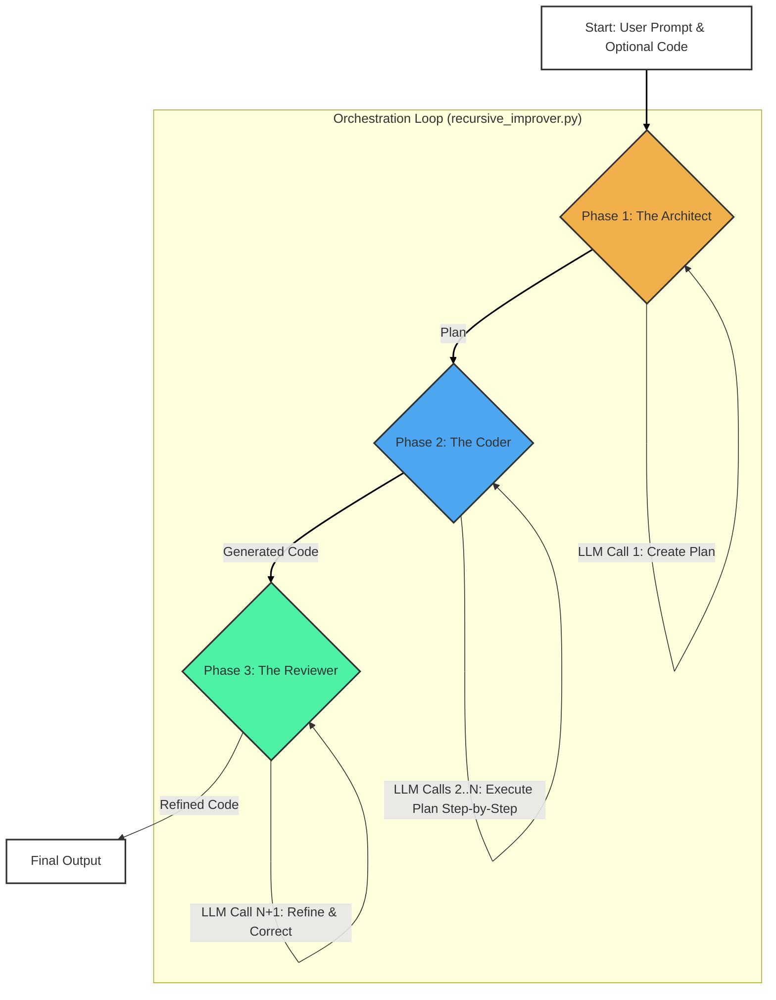

# AI Creates AI (AICAI) - Recursive Code Generation

**AICAI** is a lightweight, efficiency-first CLI tool that leverages small, high-speed Large Language Models (LLMs) hosted on the Groq API to generate, improve, and recursively refine code. It is designed for developers who want to harness the power of AI for practical software engineering tasks without the overhead of large models or complex UIs.

The project's core philosophy is inspired by the recursive, self-improving architecture outlined in the **[ASI-Arch project](https://github.com/GAIR-NLP/ASI-Arch)**. It demonstrates that even models with limited context windows (≤8K tokens) can produce complex and high-quality output through an iterative process of planning, execution, and refinement.

---

## Table of Contents

- [Project Overview](#project-overview)
- [Core Functionality](#core-functionality)
- [Groq API Integration](#groq-api-integration)
- [Architecture Flow](#architecture-flow)
- [Installation](#installation)
- [Usage Examples](#usage-examples)
- [Core Components](#core-components)
- [Design Philosophy: Lean & Powerful](#design-philosophy-lean--powerful)
- [Contributing](#contributing)
- [License & Acknowledgments](#license--acknowledgments)

---

## Project Overview

This tool is not just another code generator. It's an experiment in applied AI, built on three key principles:

1.  **Efficiency-First**: Implements only what is essential for value creation. The focus is on the core generation loop, not on extraneous features.
2.  **Recursive Improvement**: Uses a continuous feedback loop where the model's output is fed back as input for the next iteration, allowing for progressive enhancement of the code.
3.  **Small Model Optimization**: The entire workflow is designed to maximize the capabilities of small, fast models (like Llama3 8B or Gemma 7B) with limited context windows.

By taking a high-level prompt and optional code, AICAI emulates a developer's thought process: it forms a plan, breaks it down, writes the code, and then refines it.

## Core Functionality

The tool operates in a loop that mimics an advanced reasoning process, making it more powerful than a single-shot prompt.

### The Recursive Loop

1.  **Input**: The user provides a prompt (e.g., "Create a FastAPI endpoint for user authentication") and, optionally, a path to an existing code file to be improved.
2.  **Plan**: The tool sends the initial prompt to the LLM to generate a high-level plan or a list of steps required to fulfill the request.
3.  **Decompose & Execute**: For each step in the plan, the tool generates a specific, context-aware prompt. It sends this prompt along with the relevant code snippets to the LLM to write or modify the code. This decomposition is key to staying within the small context window.
4.  **Refine**: After executing the plan, the tool can run a final refinement pass. It presents the generated code back to the LLM with a prompt to "review and improve this code for clarity, efficiency, and correctness." This self-correction step is critical for quality.

This cycle can be repeated, with each pass building upon the last, to evolve a simple script into a production-ready application.

## Groq API Integration

This tool relies exclusively on the [Groq API](https://groq.com/) for its speed and efficiency.

-   **Authentication**: The tool authenticates using an API key. You must set it as an environment variable:
    ```bash
    export GROQ_API_KEY="your-groq-api-key"
    ```

-   **Model Selection**: The tool is hardcoded to use small, fast models (e.g., `llama3-8b-8192`). This is a deliberate design choice to prove the effectiveness of the recursive architecture.

-   **Working with Limited Context**: The tool is architected to handle small context windows effectively. It never sends the entire project's code. Instead, for each step, it sends only:
    - The high-level goal.
    - The specific, decomposed task.
    - The most relevant code snippet (e.g., a single function or class).

This surgical approach ensures that the context is always dense with relevant information, allowing the small model to perform as if it has a much larger understanding of the codebase.

## Architecture: A Lean Interpretation of ASI-Arch

The ASI-Arch project pioneers a powerful concept: a society of AI agents that collaborate to solve complex problems. We adapt this philosophy to a leaner, single-agent model that embodies different specialist roles through carefully crafted prompts. This allows a small 8B model to "wear different hats"—Architect, Coder, and Reviewer—to achieve a result far greater than the sum of its parts.

Our architecture is not just a sequence of prompts; it's a stateful, recursive loop where the output of one phase serves as the structured input for the next. This is how we overcome the inherent context limitations of small models.



### The Three Phases of Recursive Improvement:

1.  **Phase 1: The Architect (High-Level Planning)**
    -   **Role**: The LLM is prompted to act as a systems architect.
    -   **Input**: The user's raw request (e.g., "Build a Redis-backed caching layer for a Django app").
    -   **Process**: The model produces a high-level, step-by-step plan. It does *not* write code. It only thinks about the structure, components, and sequence of actions.
    -   **Output**: A structured plan (e.g., `["1. Install redis-py", "2. Configure Django settings", "3. Create a cache utility module"]`).
    -   **Why It's Better**: By separating planning from coding, we ensure the overall structure is logical *before* a single line of code is written. This prevents the model from getting lost in implementation details and producing unstructured, monolithic scripts.

2.  **Phase 2: The Coder (Focused Execution)**
    -   **Role**: The LLM now acts as a junior developer receiving a specific ticket.
    -   **Input**: The full plan (for context), the *current code state*, and **only one** specific step from the plan (e.g., "2. Configure Django settings").
    -   **Process**: The `recursive_improver` loops through the plan. In each iteration, it feeds the model the current code and the next task. The model's output (the newly generated code) is immediately integrated, updating the code state for the next loop.
    -   **Output**: A block of code that accomplishes one specific task.
    -   **Why It's Better**: This is the core of our small-model optimization. The context window is never filled with the entire desired application. It contains only the immediately relevant code and a single, clear instruction. This mimics how a human developer focuses on one function at a time, preventing cognitive overload and ensuring high-quality, context-aware code for each part of the application.

3.  **Phase 3: The Reviewer (Quality Assurance)**
    -   **Role**: The LLM transforms into a senior engineer performing a code review.
    -   **Input**: The *complete* code generated during the Coder phase.
    -   **Process**: The model is prompted to critically analyze the code for bugs, style violations, and potential improvements. It is explicitly told to act as a quality gate.
    -   **Output**: The final, refined code, ready for the user.
    -   **Why It's Better**: This self-correction step is crucial. The step-by-step generation in Phase 2 can sometimes lead to minor inconsistencies. The Reviewer phase smooths these out, adds docstrings, and catches subtle errors that a pure generation process might miss. It ensures the final product is not just functional, but robust and maintainable.

This architecture is more than just a prompt chain; it's a deliberate, stateful process that uses role-playing and recursion to elevate the capabilities of a small LLM to rival those of a much larger model, delivering on the promise of efficient, high-quality, AI-driven development.


## Installation

Ensure you have Python 3.8+ installed.

1.  **Clone the repository:**
    ```bash
    git clone https://github.com/your-username/aicreatesai.git
    cd aicreatesai
    ```

2.  **Install dependencies:**
    ```bash
    pip install -r requirements.txt
    ```

3.  **Set your API key:**
    ```bash
    export GROQ_API_KEY="your-groq-api-key"
    ```

## Usage Examples

### 1. Generate a New Application

Create a simple Flask web server from scratch.

```bash
python main.py --prompt "Create a simple Python web server using Flask that returns 'Hello, World!' on the root path. The server should run on port 5000." --output-file app.py
```

The tool will generate `app.py` with the complete, runnable Flask application.

### 2. Improve an Existing Function

Refactor a function in an existing file for better performance.

```bash
# Assume utils.py contains a slow function:
# def slow_data_processing(data): ...

python main.py --prompt "Refactor the 'slow_data_processing' function to be more efficient and handle potential exceptions." --file utils.py
```

The tool will modify `utils.py` in place, replacing the old function with an improved version.

### 3. Generate a Complex Algorithm

Generate a specific algorithm with requirements.

```bash
python main.py --prompt "Generate a Python function that implements the A* search algorithm. Include comments explaining the main components: the open set, the closed set, and the heuristic function." --output-file a_star.py
```

## Core Components

The codebase is intentionally simple and modular.

-   `main.py`: The CLI entry point. Uses `argparse` to handle user input and orchestrates the overall workflow.
-   `groq_client.py`: A dedicated module for all interactions with the Groq API. Handles request formatting, API calls, and error handling.
-   `recursive_improver.py`: The heart of the tool. Contains the core logic for the Plan -> Decompose -> Execute -> Refine loop.
-   `file_handler.py`: A utility for reading from and writing to files, ensuring safe and predictable file operations.
-   `prompts.py`: A centralized store for all system prompts and prompt templates. Separating prompts from logic makes them easier to tune and improve.

## Design Philosophy: Lean & Powerful

We deliberately avoid features that do not directly contribute to the core mission of recursive code improvement.

**What's Included (The Essentials):**
-   A robust CLI interface for prompts and file paths.
-   The core recursive improvement loop.
-   Clean, readable output to the console and files.
-   Direct and efficient integration with the Groq API.

**What's Not Included (By Design):**
-   A graphical user interface (GUI).
-   Project management or state-tracking features.
-   Support for multiple API providers or models outside of Groq's fast offerings.
-   Complex configuration files.

This lean approach ensures the tool remains fast, maintainable, and focused on its primary goal: making the most out of small models.

## Contributing

Contributions are welcome! This project is an exploration of AI-driven development, and new ideas are encouraged.

1.  **Fork the repository.**
2.  **Create a new branch** for your feature or bug fix: `git checkout -b feature/my-new-feature`.
3.  **Make your changes.**
4.  **Submit a pull request** with a clear description of your changes.

**Potential areas for extension:**
-   Improving the planning and decomposition logic.
-   Adding a "self-test" step where the tool attempts to run the generated code and fix errors.
-   Experimenting with different prompt engineering techniques.

## License & Acknowledgments

-   **License**: This project is licensed under the **MIT License**. See the `LICENSE` file for details.
-   **Acknowledgments**:
    -   This project is heavily inspired by the ideas presented in the **[ASI-Arch](https://github.com/GAIR-NLP/ASI-Arch)** paper and repository by GAIR-NLP.
    -   Powered by the incredible speed of the **[Groq API](https://groq.com/)**.
