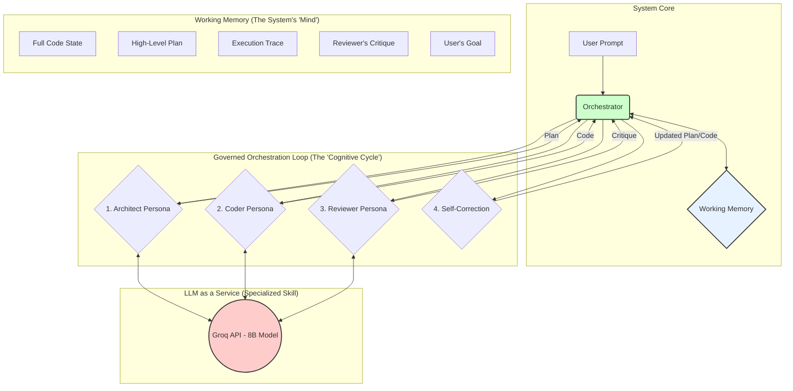

# AI Creates AI (AICAI) - Recursive Code Generation

**AICAI** is a lightweight, efficiency-first CLI tool that leverages small, high-speed Large Language Models (LLMs) hosted on the Groq API to generate, improve, and recursively refine code. It is designed for developers who want to harness the power of AI for practical software engineering tasks without the overhead of large models or complex UIs.

The project's core philosophy is inspired by the recursive, self-improving architecture outlined in the **[ASI-Arch project](https://github.com/GAIR-NLP/ASI-Arch)**. It demonstrates that even models with limited context windows (≤8K tokens) can produce complex and high-quality output through an iterative process of planning, execution, and refinement.

---

## Table of Contents

- [Project Overview](#project-overview)
- [Core Functionality](#core-functionality)
- [Groq API Integration](#groq-api-integration)
- [Architecture Flow](#architecture-flow)
- [Installation](#installation)
- [Usage Examples](#usage-examples)
- [Core Components](#core-components)
- [Design Philosophy: Lean & Powerful](#design-philosophy-lean--powerful)
- [Contributing](#contributing)
- [License & Acknowledgments](#license--acknowledgments)

---

## Project Overview

This tool is not just another code generator. It's an experiment in applied AI, built on three key principles:

1.  **Efficiency-First**: Implements only what is essential for value creation. The focus is on the core generation loop, not on extraneous features.
2.  **Recursive Improvement**: Uses a continuous feedback loop where the model's output is fed back as input for the next iteration, allowing for progressive enhancement of the code.
3.  **Small Model Optimization**: The entire workflow is designed to maximize the capabilities of small, fast models (like Llama3 8B or Gemma 7B) with limited context windows.

By taking a high-level prompt and optional code, AICAI emulates a developer's thought process: it forms a plan, breaks it down, writes the code, and then refines it.

## Core Functionality

The tool operates in a loop that mimics an advanced reasoning process, making it more powerful than a single-shot prompt.

### The Recursive Loop

1.  **Input**: The user provides a prompt (e.g., "Create a FastAPI endpoint for user authentication") and, optionally, a path to an existing code file to be improved.
2.  **Plan**: The tool sends the initial prompt to the LLM to generate a high-level plan or a list of steps required to fulfill the request.
3.  **Decompose & Execute**: For each step in the plan, the tool generates a specific, context-aware prompt. It sends this prompt along with the relevant code snippets to the LLM to write or modify the code. This decomposition is key to staying within the small context window.
4.  **Refine**: After executing the plan, the tool can run a final refinement pass. It presents the generated code back to the LLM with a prompt to "review and improve this code for clarity, efficiency, and correctness." This self-correction step is critical for quality.

This cycle can be repeated, with each pass building upon the last, to evolve a simple script into a production-ready application.

## Groq API Integration

This tool relies exclusively on the [Groq API](https://groq.com/) for its speed and efficiency.

-   **Authentication**: The tool authenticates using an API key. You must set it as an environment variable:
    ```bash
    export GROQ_API_KEY="your-groq-api-key"
    ```

-   **Model Selection**: The tool is hardcoded to use small, fast models (e.g., `llama3-8b-8192`). This is a deliberate design choice to prove the effectiveness of the recursive architecture.

-   **Working with Limited Context**: The tool is architected to handle small context windows effectively. It never sends the entire project's code. Instead, for each step, it sends only:
    - The high-level goal.
    - The specific, decomposed task.
    - The most relevant code snippet (e.g., a single function or class).

This surgical approach ensures that the context is always dense with relevant information, allowing the small model to perform as if it has a much larger understanding of the codebase.

## Architecture: A Cognitive Framework for Code Generation

To overcome the inherent limitations of small models, we don't just use a simple loop; we emulate a cognitive architecture. This approach, heavily inspired by systems like ASI-Arch and cognitive science, provides a structured environment for an 8B model to reason, plan, and self-correct, achieving a level of coherence and quality far beyond its individual capacity.

The two pillars of this architecture are the **Working Memory** and the **Governed Orchestration Loop**.



### The Working Memory: The Key to Coherence

The single biggest challenge for small models is their lack of memory. Our **Working Memory** solves this. It is a structured, in-memory state object that persists across the entire lifecycle of a task. It contains:

-   **Full Code State**: The complete, up-to-date version of the code being generated or modified.
-   **High-Level Plan**: A structured list of tasks and sub-tasks, continuously updated by the Architect.
-   **Execution Trace**: A log of which plan steps have been completed, which have failed, and which are pending. This prevents the system from getting stuck in loops.
-   **Reviewer's Critique**: A list of actionable bugs, suggestions, and required changes from the last review cycle.
-   **User's Goal**: The original, unmodified prompt from the user, serving as the ultimate source of truth.

By maintaining this central state, we ensure that every persona has access to the full context of the task, even if the LLM call itself only uses a small part of it.

### The Governed Orchestration Loop

This is the heart of the system. The **Orchestrator** (`recursive_improver.py`) is not just a simple loop; it's a state machine that intelligently invokes different personas based on the contents of the Working Memory.

#### 1. The Architect Persona (The Planner)
-   **Trigger**: Invoked at the start of the process or when the Reviewer's Critique demands a change in strategy.
-   **Input from Memory**: User's Goal, existing Plan (if any), Reviewer's Critique.
-   **Core Logic**: 
    1.  **Analyze Goal**: Understand the user's core intent.
    2.  **Analyze Critique**: Identify high-level flaws in the current approach.
    3.  **Generate/Refine Plan**: Create or modify the High-Level Plan in the Working Memory. This includes breaking down tasks into the smallest possible, verifiable steps (e.g., "import library," "create function signature," "add `try...except` block").
-   **Why it Works**: This isolates strategic thinking from implementation. The plan becomes a structured, machine-readable set of instructions, which is far more reliable than prose.

#### 2. The Coder Persona (The Implementer)
-   **Trigger**: Invoked when the Plan has pending tasks in the Execution Trace.
-   **Input from Memory**: A *single* step from the Plan, and the relevant snippet of the Full Code State.
-   **Core Logic**:
    1.  **Isolate Context**: The Orchestrator intelligently extracts the minimum necessary code from the Full Code State that is relevant to the current task.
    2.  **Generate Code**: The Coder persona is prompted to write the code for *only that single step*.
    3.  **Update State**: The generated code is integrated back into the Full Code State in Working Memory.
-   **Why it Works**: This is the ultimate solution to the context window problem. The LLM is never burdened with the full application. It operates on a tiny, focused slice of the problem, which allows the 8B model to perform with high precision.

#### 3. The Reviewer Persona (The Quality Controller)
-   **Trigger**: Invoked after the Coder has completed a set of tasks.
-   **Input from Memory**: The Full Code State and the High-Level Plan.
-   **Core Logic**:
    1.  **Holistic Analysis**: Unlike the Coder, the Reviewer is prompted to look at the *entire* generated code.
    2.  **Generate Structured Critique**: It identifies bugs, style issues, and deviations from the plan. The output is not just text, but a structured list of issues (e.g., `{"type": "BUG", "file": "app.py", "line": 42, "description": "Database connection is not closed"}`).
    3.  **Update State**: This structured critique is saved to the Reviewer's Critique section of the Working Memory.
-   **Why it Works**: By forcing the LLM to produce structured output, we turn a subjective review into a machine-readable set of tasks. This allows the Orchestrator to make deterministic decisions in the next phase.

#### 4. Self-Correction (The Decider)
-   **Trigger**: The final step in every loop.
-   **Input from Memory**: The entire Working Memory.
-   **Core Logic**:
    1.  **Check for Completion**: If the Reviewer's Critique is empty and all plan steps are complete, the process is finished.
    2.  **Route for Correction**: If the Critique contains issues, the Orchestrator decides where to send them. A bug in the code might create a new task for the Coder. A fundamental flaw in the logic will send the critique back to the Architect to revise the entire plan.
    3.  **Loop**: The process repeats, feeding the refined plan and critique back into the system.
-   **Why it Works**: This closes the loop. It's the mechanism that enables true, recursive self-improvement and prevents the system from simply outputting a flawed first draft.

This cognitive architecture provides the structure, memory, and feedback loops necessary for a small model to perform complex software engineering tasks in a robust, reliable, and high-quality manner.


## Installation

Ensure you have Python 3.8+ installed.

1.  **Clone the repository:**
    ```bash
    git clone https://github.com/your-username/aicreatesai.git
    cd aicreatesai
    ```

2.  **Install dependencies:**
    ```bash
    pip install -r requirements.txt
    ```

3.  **Set your API key:**
    ```bash
    export GROQ_API_KEY="your-groq-api-key"
    ```

## Usage Examples

### 1. Generate a New Application

Create a simple Flask web server from scratch.

```bash
python main.py --prompt "Create a simple Python web server using Flask that returns 'Hello, World!' on the root path. The server should run on port 5000." --output-file app.py
```

The tool will generate `app.py` with the complete, runnable Flask application.

### 2. Improve an Existing Function

Refactor a function in an existing file for better performance.

```bash
# Assume utils.py contains a slow function:
# def slow_data_processing(data): ...

python main.py --prompt "Refactor the 'slow_data_processing' function to be more efficient and handle potential exceptions." --file utils.py
```

The tool will modify `utils.py` in place, replacing the old function with an improved version.

### 3. Generate a Complex Algorithm

Generate a specific algorithm with requirements.

```bash
python main.py --prompt "Generate a Python function that implements the A* search algorithm. Include comments explaining the main components: the open set, the closed set, and the heuristic function." --output-file a_star.py
```

## Core Components

The codebase is intentionally simple and modular.

-   `main.py`: The CLI entry point. Uses `argparse` to handle user input and orchestrates the overall workflow.
-   `groq_client.py`: A dedicated module for all interactions with the Groq API. Handles request formatting, API calls, and error handling.
-   `recursive_improver.py`: The heart of the tool. Contains the core logic for the Plan -> Decompose -> Execute -> Refine loop.
-   `file_handler.py`: A utility for reading from and writing to files, ensuring safe and predictable file operations.
-   `prompts.py`: A centralized store for all system prompts and prompt templates. Separating prompts from logic makes them easier to tune and improve.

## Design Philosophy: Lean & Powerful

We deliberately avoid features that do not directly contribute to the core mission of recursive code improvement.

**What's Included (The Essentials):**
-   A robust CLI interface for prompts and file paths.
-   The core recursive improvement loop.
-   Clean, readable output to the console and files.
-   Direct and efficient integration with the Groq API.

**What's Not Included (By Design):**
-   A graphical user interface (GUI).
-   Project management or state-tracking features.
-   Support for multiple API providers or models outside of Groq's fast offerings.
-   Complex configuration files.

This lean approach ensures the tool remains fast, maintainable, and focused on its primary goal: making the most out of small models.

## Contributing

Contributions are welcome! This project is an exploration of AI-driven development, and new ideas are encouraged.

1.  **Fork the repository.**
2.  **Create a new branch** for your feature or bug fix: `git checkout -b feature/my-new-feature`.
3.  **Make your changes.**
4.  **Submit a pull request** with a clear description of your changes.

**Potential areas for extension:**
-   Improving the planning and decomposition logic.
-   Adding a "self-test" step where the tool attempts to run the generated code and fix errors.
-   Experimenting with different prompt engineering techniques.

## License & Acknowledgments

-   **License**: This project is licensed under the **MIT License**. See the `LICENSE` file for details.
-   **Acknowledgments**:
    -   This project is heavily inspired by the ideas presented in the **[ASI-Arch](https://github.com/GAIR-NLP/ASI-Arch)** paper and repository by GAIR-NLP.
    -   Powered by the incredible speed of the **[Groq API](https://groq.com/)**.
