# AI Creates AI (AICAI) - Recursive Code Generation

**AICAI** is a lightweight, efficiency-first CLI tool that leverages small, high-speed Large Language Models (LLMs) hosted on the Groq API to generate, improve, and recursively refine code. It is designed for developers who want to harness the power of AI for practical software engineering tasks without the overhead of large models or complex UIs.

The project's core philosophy is inspired by the recursive, self-improving architecture outlined in the **[ASI-Arch project](https://github.com/GAIR-NLP/ASI-Arch)**. It demonstrates that even models with limited context windows (≤8K tokens) can produce complex and high-quality output through an iterative process of planning, execution, and refinement.

---

## Table of Contents

- [Project Overview](#project-overview)
- [Core Functionality](#core-functionality)
- [Groq API Integration](#groq-api-integration)
- [Architecture Flow](#architecture-flow)
- [Installation](#installation)
- [Usage Examples](#usage-examples)
- [Core Components](#core-components)
- [Design Philosophy: Lean & Powerful](#design-philosophy-lean--powerful)
- [Contributing](#contributing)
- [License & Acknowledgments](#license--acknowledgments)

---

## Project Overview

This tool is not just another code generator. It's an experiment in applied AI, built on three key principles:

1.  **Efficiency-First**: Implements only what is essential for value creation. The focus is on the core generation loop, not on extraneous features.
2.  **Recursive Improvement**: Uses a continuous feedback loop where the model's output is fed back as input for the next iteration, allowing for progressive enhancement of the code.
3.  **Small Model Optimization**: The entire workflow is designed to maximize the capabilities of small, fast models (like Llama3 8B or Gemma 7B) with limited context windows.

By taking a high-level prompt and optional code, AICAI emulates a developer's thought process: it forms a plan, breaks it down, writes the code, and then refines it.

## Core Functionality

The tool operates in a loop that mimics an advanced reasoning process, making it more powerful than a single-shot prompt.

### The Recursive Loop

1.  **Input**: The user provides a prompt (e.g., "Create a FastAPI endpoint for user authentication") and, optionally, a path to an existing code file to be improved.
2.  **Plan**: The tool sends the initial prompt to the LLM to generate a high-level plan or a list of steps required to fulfill the request.
3.  **Decompose & Execute**: For each step in the plan, the tool generates a specific, context-aware prompt. It sends this prompt along with the relevant code snippets to the LLM to write or modify the code. This decomposition is key to staying within the small context window.
4.  **Refine**: After executing the plan, the tool can run a final refinement pass. It presents the generated code back to the LLM with a prompt to "review and improve this code for clarity, efficiency, and correctness." This self-correction step is critical for quality.

This cycle can be repeated, with each pass building upon the last, to evolve a simple script into a production-ready application.

## Groq API Integration

This tool relies exclusively on the [Groq API](https://groq.com/) for its speed and efficiency.

-   **Authentication**: The tool authenticates using an API key. You must set it as an environment variable:
    ```bash
    export GROQ_API_KEY="your-groq-api-key"
    ```

-   **Model Selection**: The tool is hardcoded to use small, fast models (e.g., `llama3-8b-8192`). This is a deliberate design choice to prove the effectiveness of the recursive architecture.

-   **Working with Limited Context**: The tool is architected to handle small context windows effectively. It never sends the entire project's code. Instead, for each step, it sends only:
    - The high-level goal.
    - The specific, decomposed task.
    - The most relevant code snippet (e.g., a single function or class).

This surgical approach ensures that the context is always dense with relevant information, allowing the small model to perform as if it has a much larger understanding of the codebase.

## Architecture: A Cognitive-Inspired Framework for Autonomous Improvement

To truly harness the power of small, high-speed models, a simple loop is insufficient. We have implemented a cognitive-inspired framework that provides the structure and memory necessary for complex reasoning and autonomous self-improvement. This architecture is a direct, practical application of the principles found in advanced AI systems like ASI-Arch, but adapted for the specific domain of code generation.

The system is built on two core components: a persistent **Working Memory** and a state-driven **Orchestrator** that deploys specialized LLM-based personas.

```mermaid
%%{init: {'theme': 'dark', 'themeVariables': {
    'primaryColor': '#1a1a1a',
    'primaryTextColor': '#fff',
    'secondaryColor': '#333',
    'lineColor': '#888',
    'tertiaryColor': '#222',
    'fontFamily': 'Fira Code, monospace'
}}}%%
graph TD
    subgraph "AICAI Cognitive Cycle"
        direction LR

        subgraph "🧠 Orchestrator (Python State Machine)"
            direction TB
            Orchestrator("<b>Orchestrator</b><br><i>Drives the process</i>")
            style Orchestrator fill:#0891B2,stroke:#CFD8DC

            subgraph "Persona Execution"
                direction TB
                Architect("<b>1. Architect</b><br><i>Generates/Refines Plan</i>")
                Coder("<b>2. Coder</b><br><i>Implements Plan Tasks</i>")
                Reviewer("<b>3. Reviewer</b><br><i>Generates Structured Critique</i>")
                Corrector("<b>4. Corrector</b><br><i>Decides Next State</i>")
            end
        end

        subgraph "💾 Working Memory (Python Dataclass)"
            direction TB
            WM("<b>Working Memory</b><br><i>The system's 'consciousness'</i>")
            style WM fill:#F57F17,stroke:#CFD8DC

            WM_Goal["<br><b>User Goal</b><br><font size=2>Immutable user prompt</font>"]
            WM_Plan["<br><b>Plan</b><br><font size=2>Structured task list (JSON)</font>"]
            WM_Code["<br><b>Code State</b><br><font size=2>Current version of all files</font>"]
            WM_Critique["<br><b>Critique</b><br><font size=2>Machine-readable issues (JSON)</font>"]
        end

        subgraph "🤖 LLM as a Service (Groq API)"
            LLM("<b>Llama3 8B</b><br><i>Stateless Tool</i>")
            style LLM fill:#5E35B1,stroke:#CFD8DC
        end
    end

    %% Connections
    User_Input[(User Prompt)] --> Orchestrator

    Orchestrator -- "Activates" --> Architect
    Architect -- "Reads Goal & Critique" --> WM_Goal
    Architect -- "Reads Goal & Critique" --> WM_Critique
    Architect -- "LLM Call" --> LLM
    LLM -- "Generates Plan" --> Architect
    Architect -- "Updates" --> WM_Plan

    Orchestrator -- "Activates" --> Coder
    Coder -- "Reads Plan & Code" --> WM_Plan
    Coder -- "Reads Plan & Code" --> WM_Code
    Coder -- "LLM Call" --> LLM
    LLM -- "Generates Code" --> Coder
    Coder -- "Updates" --> WM_Code

    Orchestrator -- "Activates" --> Reviewer
    Reviewer -- "Reads Plan & Code" --> WM_Plan
    Reviewer -- "Reads Plan & Code" --> WM_Code
    Reviewer -- "LLM Call" --> LLM
    LLM -- "Generates Critique" --> Reviewer
    Reviewer -- "Updates" --> WM_Critique

    Orchestrator -- "Activates" --> Corrector
    Corrector -- "Reads Critique" --> WM_Critique
    Corrector -- "Decides next action" --> Orchestrator

    Final_Output[(Final Code)]
    Orchestrator -- "Loop terminates" --> Final_Output

    style User_Input fill:#4CAF50,stroke:#CFD8DC
    style Final_Output fill:#4CAF50,stroke:#CFD8DC
    style Architect fill:#0288D1,stroke:#CFD8DC
    style Coder fill:#0288D1,stroke:#CFD8DC
    style Reviewer fill:#0288D1,stroke:#CFD8DC
    style Corrector fill:#C2185B,stroke:#CFD8DC
```



### The Working Memory: The System's Consciousness

This is the key to overcoming the context limitations of small models. The Working Memory is a structured Python object that holds the complete state of the task. It allows the Orchestrator to maintain a coherent "thought process" across dozens of individual LLM calls.

-   **Full Code State**: A dictionary mapping file paths to their current content. This is the ground truth of the project.
-   **High-Level Plan**: A list of dictionaries, where each dictionary is a task with an ID, a description, and a status (`pending`, `completed`, `error`). This is the system's roadmap.
-   **Execution Trace**: A log of every action the Orchestrator takes. This is crucial for debugging and preventing infinite loops.
-   **Structured Critique**: A list of machine-readable issues (e.g., `{"type": "BUG", "file": "app.py", "line": 42, "description": "..."}`). This is the output of the Reviewer and the input for the Self-Correction logic.
-   **User's Goal**: The original prompt, which serves as the ultimate objective for every persona.

### The Orchestrator: The Engine of Cognition

The Orchestrator is a state machine that drives the improvement loop. It uses the Working Memory to decide which persona to activate and what information to provide them.

#### 1. The Architect Persona (The Planner)
-   **Task**: High-level strategic thinking.
-   **Process**: Reads the `User's Goal` and the `Structured Critique` from Working Memory. It produces a new, refined `High-Level Plan` to address the user's request and fix any identified architectural flaws.
-   **Why it Works**: It separates *what* to do from *how* to do it. This allows the system to make intelligent, high-level decisions before getting bogged down in implementation details.

#### 2. The Coder Persona (The Implementer)
-   **Task**: Focused, tactical code generation.
-   **Process**: The Orchestrator provides the Coder with a *single* task from the `High-Level Plan` and the *minimum necessary code* from the `Full Code State`. The Coder's only job is to write the code for that one task.
-   **Why it Works**: This is the core of our small-model optimization. By providing only the most relevant context, we enable the 8B model to perform with the precision of a much larger model on a highly constrained problem.

#### 3. The Reviewer Persona (The Quality Analyst)
-   **Task**: Holistic code analysis and structured feedback.
-   **Process**: The Reviewer examines the `Full Code State` and the `High-Level Plan`. It does not write code. Instead, it generates a `Structured Critique`—a JSON object detailing bugs, style violations, and deviations from the plan.
-   **Why it Works**: By forcing the LLM to produce structured JSON, we transform a subjective code review into objective, machine-readable data. This is essential for the next step.

#### 4. Self-Correction Logic (The Decision Maker)
-   **Task**: To intelligently close the loop. This is pure Python code, not an LLM call.
-   **Process**: The Orchestrator analyzes the `Structured Critique`.
    -   If the critique is empty, the task is complete, and the loop terminates.
    -   If the critique contains bugs, the Orchestrator adds new tasks to the `High-Level Plan` to fix them and routes back to the **Coder**.
    -   If the critique contains fundamental architectural issues, it routes back to the **Architect** to rethink the plan.
-   **Why it Works**: This is the mechanism that enables true, autonomous improvement. The system can identify its own mistakes and intelligently decide how to fix them, creating a virtuous cycle of refinement.

This detailed, cognitive-inspired architecture is designed to be robust, efficient, and highly effective, allowing a small, fast 8B model to deliver results that rival those of much larger, slower, and more expensive systems.


## Installation

Ensure you have Python 3.8+ installed.

1.  **Clone the repository:**
    ```bash
    git clone https://github.com/your-username/aicreatesai.git
    cd aicreatesai
    ```

2.  **Install dependencies:**
    ```bash
    pip install -r requirements.txt
    ```

3.  **Set your API key:**
    ```bash
    export GROQ_API_KEY="your-groq-api-key"
    ```

## Usage Examples

### 1. Generate a New Application

Create a simple Flask web server from scratch.

```bash
python main.py --prompt "Create a simple Python web server using Flask that returns 'Hello, World!' on the root path. The server should run on port 5000." --output-file app.py
```

The tool will generate `app.py` with the complete, runnable Flask application.

### 2. Improve an Existing Function

Refactor a function in an existing file for better performance.

```bash
# Assume utils.py contains a slow function:
# def slow_data_processing(data): ...

python main.py --prompt "Refactor the 'slow_data_processing' function to be more efficient and handle potential exceptions." --file utils.py
```

The tool will modify `utils.py` in place, replacing the old function with an improved version.

### 3. Generate a Complex Algorithm

Generate a specific algorithm with requirements.

```bash
python main.py --prompt "Generate a Python function that implements the A* search algorithm. Include comments explaining the main components: the open set, the closed set, and the heuristic function." --output-file a_star.py
```

## Core Components

The codebase is intentionally simple and modular.

-   `main.py`: The CLI entry point. Uses `argparse` to handle user input and orchestrates the overall workflow.
-   `groq_client.py`: A dedicated module for all interactions with the Groq API. Handles request formatting, API calls, and error handling.
-   `recursive_improver.py`: The heart of the tool. Contains the core logic for the Plan -> Decompose -> Execute -> Refine loop.
-   `file_handler.py`: A utility for reading from and writing to files, ensuring safe and predictable file operations.
-   `prompts.py`: A centralized store for all system prompts and prompt templates. Separating prompts from logic makes them easier to tune and improve.

## Design Philosophy: Lean & Powerful

We deliberately avoid features that do not directly contribute to the core mission of recursive code improvement.

**What's Included (The Essentials):**
-   A robust CLI interface for prompts and file paths.
-   The core recursive improvement loop.
-   Clean, readable output to the console and files.
-   Direct and efficient integration with the Groq API.

**What's Not Included (By Design):**
-   A graphical user interface (GUI).
-   Project management or state-tracking features.
-   Support for multiple API providers or models outside of Groq's fast offerings.
-   Complex configuration files.

This lean approach ensures the tool remains fast, maintainable, and focused on its primary goal: making the most out of small models.

## Contributing

Contributions are welcome! This project is an exploration of AI-driven development, and new ideas are encouraged.

1.  **Fork the repository.**
2.  **Create a new branch** for your feature or bug fix: `git checkout -b feature/my-new-feature`.
3.  **Make your changes.**
4.  **Submit a pull request** with a clear description of your changes.

**Potential areas for extension:**
-   Improving the planning and decomposition logic.
-   Adding a "self-test" step where the tool attempts to run the generated code and fix errors.
-   Experimenting with different prompt engineering techniques.

## License & Acknowledgments

-   **License**: This project is licensed under the **MIT License**. See the `LICENSE` file for details.
-   **Acknowledgments**:
    -   This project is heavily inspired by the ideas presented in the **[ASI-Arch](https://github.com/GAIR-NLP/ASI-Arch)** paper and repository by GAIR-NLP.
    -   Powered by the incredible speed of the **[Groq API](https://groq.com/)**.
